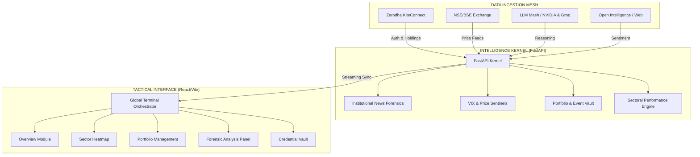

# FinIntel Terminal: Strategic Intelligence Nexus
> **Institutional-grade financial intelligence terminal designed for the Indian market. Optimized for high-fidelity retail research, professional portfolio management, and strategic market forensics.**

---

## 🏛️ Strategic Architecture Map



---

## 📑 Table of Contents
- [🏛️ Strategic Architecture](#-strategic-architecture-map)
- [🚀 Institutional Feature Set](#-institutional-feature-set)
- [🛠️ Institutional Tech Stack](#-institutional-tech-stack)
- [⚡ Getting Started](#-getting-started)
- [⚙️ Granular Configuration](#-granular-configuration)
- [📂 Project Topology](#-project-topology)
- [🛡️ Security & Compliance](#-security--compliance)

---

## 🚀 Institutional Feature Set

### 1. Market Intelligence Dashboard
- **Institutional Flow Tracker:** Real-time tracking of FII/DII net flows and Bulk/Block deals. Uses LLM-driven forensic extraction from professional news feeds.
- **Titan Social Sentinel:** Automated intelligence gathering from X (Twitter) and professional blogs for major high-conviction Indian investors.
- **Volatility Sentinel:** Background monitoring of India VIX (^INDIAVIX) with native Windows OS alerts triggered at the 20-point threshold.

### 2. Strategic Research Module
- **Institutional Ticker Research:** Multi-LLM reasoning (NVIDIA NIM 405B, Groq 70B) with persistent context for deep-dive ticker analysis.
- **Fine Print Forensic Scanner:** Advanced NLP engine for scanning regulatory filings, legal documents, and fine print for risk clauses and regulatory flags.
- **Market Accumulation Pulse:** Pattern detection logic to identify institutional accumulation or distribution phases.

### 3. Professional Portfolio Vault
- **Real-time Asset Tracking:** Automated PnL calculation synchronized with live NSE/BSE exchange data via `yfinance`.
- **Sector Performance Heatmap:** Visual top-down rotation analysis across primary Nifty sectoral indices (Bank, Auto, IT, Pharma, etc.).

---

## 🛠️ Institutional Tech Stack

- **Backend:** Python 3.10+, FastAPI (Asynchronous Kernel), Uvicorn.
- **Frontend:** React 18, Vite, Tailwind CSS, Framer Motion (Institutional UI).
- **Intelligence Mesh:** NVIDIA NIM (Llama-3.1), Groq Cloud, OpenRouter, OpenAI.
- **Data Protocols:** KiteConnect SDK, YFinance, DuckDuckGo Forensic Search.
- **Security:** AES-256 (Fernet) Encryption, SQLite Secure Local Vault.

---

## ⚡ Getting Started

### 1. Zero-Config Global Ignition
The terminal is designed for a single-command deployment. Clone the repository and run:
```powershell
./install.ps1
finintel
```
*The installer automatically provisions Python dependencies, Node modules, and registers the global terminal command.*

### 2. Manual Activation
```bash
# Backend Ignition
cd backend && pip install -r requirements.txt
python main.py

# Frontend Ignition
npm install && npm run dev
```

---

## ⚙️ Granular Configuration

### A. Zerodha KiteConnect (Institutional Sync)
To enable live portfolio forensics and brokerage session handshakes:
1.  **Register App:** Visit [Zerodha Developers](https://developers.kite.trade/apps).
2.  **Redirect URL:** Set exactly to `http://localhost:8008/market/zerodha/callback`.
3.  **Client ID:** Your standard Zerodha ID (e.g., AB1234).
4.  **API Key/Secret:** Obtain from the Developer Console and enter in the **Settings** tab.
5.  **TOTP Seed:** Ensure 2FA is active. Capture the Secret Seed during setup to enable automated session persistence.

### B. LLM Intelligence Mesh
Configure these in the **Credential Vault** (Settings Panel):
- **NVIDIA NIM:** Recommended for high-conviction strategic research (Meta-Llama-3.1-405B).
- **Groq Cloud:** Recommended for low-latency institutional news forensics.
- **OpenRouter:** Provides universal fallback to Claude 3.5 Sonnet and Gemini 1.5 Pro.

---

## 📂 Project Topology

```text
finintel-pro/
├── backend/
│   ├── main.py          # Intelligence Kernel (FastAPI)
│   ├── requirements.txt # Kernel Dependency Manifest
├── src/
│   ├── components/      # Tactical Interface Modules
│   │   ├── OverviewPanel.tsx
│   │   ├── SectorPanel.tsx
│   │   ├── PortfolioPanel.tsx
│   │   ├── ResearchPanel.tsx
│   │   └── SettingsPanel.tsx
│   └── App.tsx          # Terminal Entry Point
├── install.ps1          # Global Path Injector & Provisioner
├── run.py               # Root Strategic Orchestrator
├── finintel.db          # Encrypted SQLite Vault
└── secret.key           # AES-256 Master Fernet Key
```

---

## 🛡️ Security & Compliance
- **Local Sovereignty:** No credentials or portfolio data ever leave your machine.
- **AES-256 Encryption:** All vaulted secrets are encrypted via the Fernet protocol.
- **Institutional Ethics:** Designed for professional research and personal strategic analysis.

---

**FinIntel Terminal v4.6 Build.**
🛡️💹
