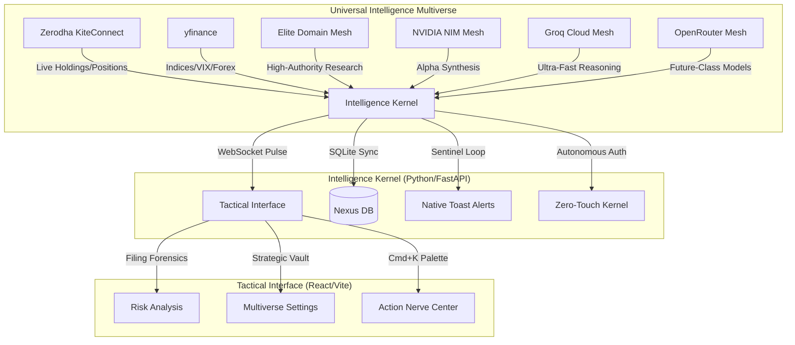

# 🛡️ Sovereign Intelligence Nexus (v2.6)
### *Strategic Command Center for Elite Indian Retail Traders*

> **Status:** Gold Master | **Build:** v2.6 | **System:** Sovereign Intelligence Nexus

The Sovereign Intelligence Nexus is a high-fidelity, local-first intelligence engine engineered to provide retail traders with institutional-grade edge. It synthesizes real-time market pulse, forensic document analysis, and institutional whale-tracking into a strictly utilitarian, zero-distraction tactical environment.

---

## 🗺️ System Architecture (The Nexus Map)



---

## 🛡️ Core Features
- **Intelligence Multiverse:** Decentralized support for NVIDIA NIM, Groq, OpenRouter, and OpenAI.
- **Strategic Vault UI:** Multi-card command center for real-time key verification and model selection.
- **Future-Proofing:** Pre-configured for future-grade models (GPT-5.5, Claude Opus 4.7).
- **Zero-Touch Auth:** Autonomous daily Zerodha session synchronization using headless TOTP 2FA.
- **Elite Domain Mesh:** Research queries weighted against high-authority finance domains.
- **Forensic Filing Engine:** LLM-powered scanning of regulatory documents for "fine print" risks.

---

## 🧠 The Intelligence Multiverse

The Nexus v2.6 utilizes a **Universal Reasoning Mesh**, allowing you to switch between elite providers in real-time:

| Provider | Tactical Advantage | Primary Variable |
| :--- | :--- | :--- |
| **NVIDIA NIM** | Free Institutional Power (Llama 405B) | `NVIDIA_API_KEY` |
| **Groq Cloud** | Ultra-Fast Strategic Scans | `GROQ_API_KEY` |
| **OpenRouter** | Decentralized Future-Class Models | `OPENROUTER_API_KEY` |
| **OpenAI** | Industry Standard Redundancy | `OPENAI_API_KEY` |

> [!TIP]
> Use the **Strategic Vault** in the interface to verify your keys and select your active model dropdown. The Nexus Kernel autonomously synchronizes with your chosen intelligence tier.

---

## ⚡ Zerodha Tactical Integration

1. **Vault Your Credentials:** Navigate to the **Settings** tab in the Nexus Interface.
2. **Inject Strategic Data:** Enter your Zerodha ID, Password, TOTP Secret, API Key, and API Secret.
3. **Ignite Sync:** Click **"Ignite Nexus Sync"**. The Nexus handles the 2FA and session autonomously.

---

## 🛠️ Tactical Installation

### Windows (Native/PowerShell)
1. **Ignite Installer:**
   ```powershell
   .\install.ps1
   ```
2. **Launch Nexus:** Execute `.\finintel.ps1` or `python run.py`.

---
**Status: Sovereign & Invincible.**
*Powered by the Universal Intelligence Multiverse.*
