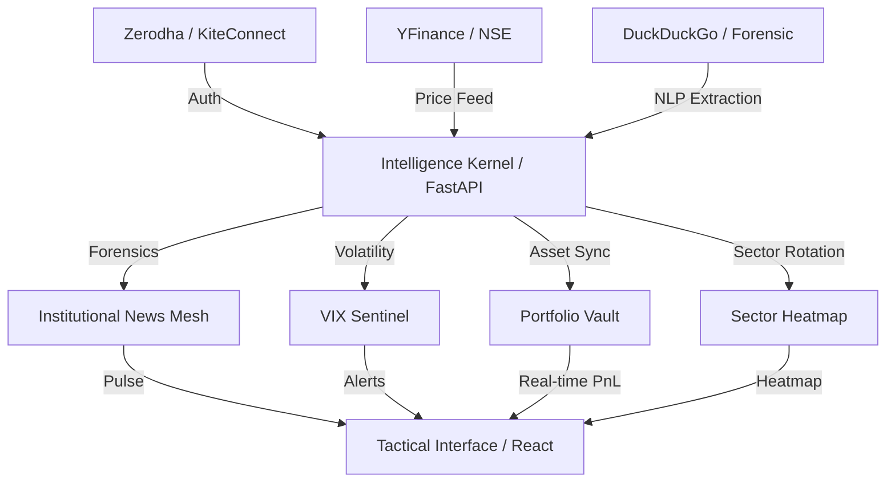

# FinIntel Terminal / Strategic Intelligence Nexus

Institutional-grade financial intelligence terminal designed for the Indian market. Optimized for high-fidelity retail research, professional portfolio management, and strategic market forensics.

---

## 🏛️ Strategic Architecture Map



---

## ⚡ Zero-Config Ignition

From a clean repository, run the global orchestrator to weaponize the entire terminal:

```powershell
./install.ps1
finintel
```

---

## 🛠️ Tactical Setup & Configuration

### 1. Zerodha KiteConnect Integration
To enable real-time portfolio sync and brokerage forensics:
1.  **Create App:** Visit [Zerodha Developers](https://developers.kite.trade/apps).
2.  **Redirect URL:** Set to `http://localhost:8008/market/zerodha/callback`.
3.  **Credentials:** Obtain your **API Key** and **API Secret**.
4.  **Client ID:** Use your standard Zerodha Client ID (found in your Kite Profile).
5.  **TOTP:** Ensure TOTP is enabled on your Zerodha account and capture the **Secret Key** (Seed) during setup.

### 2. Multi-LLM Intelligence Mesh
Manage these in the **Settings** tab of the terminal:
- **NVIDIA NIM:** High-fidelity Llama-3.1 405B reasoning.
- **Groq Cloud:** Ultra-low latency Llama-3 70B forensics.
- **OpenRouter:** Universal access to Claude 3.5, Gemini 1.5, and GPT-4o.
- **OpenAI:** Native GPT-4 integration.

### 3. Professional Feature Set
- **Market Intelligence:** FII/DII flow, Bulk/Block deals, and India VIX Sentinel.
- **Sector Heatmap:** Professional top-down rotation visualization.
- **Forensic Document Analysis:** NLP-powered scan of legal fine print and regulatory filings.
- **Portfolio Management:** AES-256 encrypted vault with real-time PnL.

---

## 🛡️ Security & Compliance

- **AES-256 Vault:** All credentials (API Keys, Broker secrets) are encrypted locally using Fernet (AES-256).
- **Compliance:** Designed for personal research use. Professional TOTP flow handles Zerodha session handshakes securely.

---

**Institutional Master v4.3 Build.**
🛡️💹
