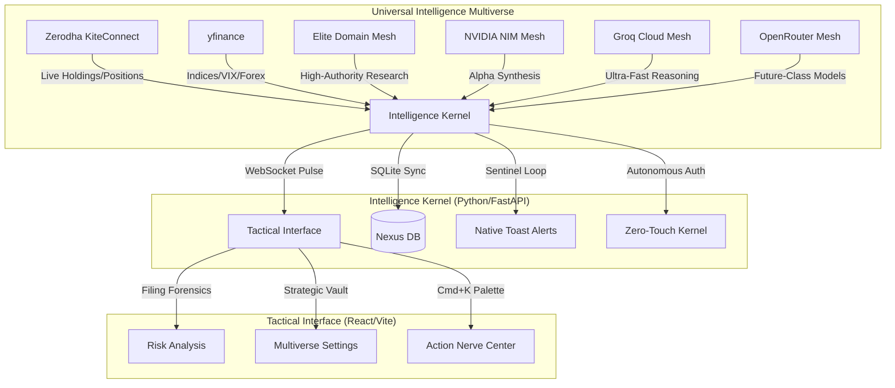

# 🛡️ Sovereign Intelligence Nexus (v2.6)
### *Strategic Command Center for Elite Indian Retail Traders*

> **Status:** Gold Master | **Build:** v2.6 | **System:** Sovereign Intelligence Nexus

The Sovereign Intelligence Nexus is a high-fidelity, local-first intelligence engine engineered to provide retail traders with institutional-grade edge. It synthesizes real-time market pulse, forensic document analysis, and institutional whale-tracking into a strictly utilitarian, zero-distraction tactical environment.

---

## 🗺️ System Architecture (The Nexus Map)



---

## 🛡️ Core Strategic Features

- **Intelligence Multiverse:** Decentralized support for NVIDIA NIM, Groq, OpenRouter, and OpenAI. Switch intelligence tiers in real-time based on cost, speed, or power requirements.
- **Zero-Touch Zerodha Auth:** Autonomous daily session synchronization. The system performs headless logins, generates TOTP tokens, and establishes the KiteConnect stream without user intervention.
- **Elite Domain Mesh:** A specialized forensic search engine that weights intelligence from high-authority finance domains (Moneycontrol, SEBI, NSE) while filtering out retail "noise."
- **Forensic Filing Engine:** Specialized LLM-powered scanning of regulatory filings, court cases, and corporate announcements to identify hidden risks and "fine print" liabilities.
- **Sentinel Sync Loop:** Background monitoring of India VIX (>20 alert), FII/DII net flows, and global market direction (Gift Nifty) to provide a 360-degree tactical overview.
- **Global Tactical Command:** Once installed, the `finintel` command is available from any directory on your machine.

---

## 🛠️ Tactical Installation Guide

### Windows (Native Deployment)
1. **Provisioning:** Install Python 3.10+ and Node.js 20+.
2. **Nexus Installation:**
   ```powershell
   # Run the institutional installer to provision dependencies and register the global command
   .\install.ps1
   ```
   > [!IMPORTANT]
   > After running the installer, **RESTART your terminal** to initialize the global `finintel` path.

3. **Nexus Ignition:**
   ```powershell
   # Type this from ANY directory to ignite the Nexus
   finintel
   ```

---

## 🔑 The Sovereign Key Vault

To ignite the Nexus, populate your `.env` file or the **Strategic Vault** UI with these tactical keys:

| Category | Tactical Key | Priority | Purpose |
| :--- | :--- | :--- | :--- |
| **Broker** | `ZERODHA_API_KEY` | **Mandatory** | Primary Market Data & Trade Stream |
| **Broker** | `ZERODHA_API_SECRET`| **Mandatory** | Secure Session & Handshake Generation |
| **Broker** | `ZERODHA_USER_ID` | **Recommended**| Required for Zero-Touch Autonomous Sync |
| **Broker** | `ZERODHA_PASSWORD` | **Recommended**| Encrypted at rest for Autonomous Login |
| **Broker** | `ZERODHA_TOTP_SECRET`| **Recommended**| Used by the pyotp kernel for 2FA bypass |
| **Intelligence**| `NVIDIA_API_KEY` | **Priority 1** | Free Institutional Reasoning (Llama 405B) |
| **Intelligence**| `GROQ_API_KEY` | **Priority 2** | Ultra-High Speed Strategic Reasoning |
| **Intelligence**| `OPENROUTER_API_KEY`| **Priority 3** | Access to Future-Grade Models (GPT-5.5) |

---

## ⚡ Zerodha Tactical Deployment

### Phase 1: Portal Configuration
1. **Developer Portal:** Navigate to [https://kite.trade/apps](https://kite.trade/apps).
2. **App Creation:** Click **"Create New App"** (Top Right).
3. **The Client ID:** You will be asked for your **Zerodha Client ID**. 
   - **Discovery:** Open [Kite Web](https://kite.zerodha.com/), click on your Profile (Bottom Left). Your ID (e.g., `AB1234`) is under your name.
4. **Redirect URL:** Set exactly to `http://127.0.0.1`.
5. **Key Extraction:** Once created, click the app to find your **API Key** and **API Secret**.

### Phase 2: Authentication Handshake

#### Option A: Zero-Touch Auth (Automated)
1. Navigate to the **Settings** tab in the Nexus UI.
2. Enter your Client ID, Password, and TOTP Secret.
3. Click **"Ignite Nexus Sync"**. The Nexus autonomously performs the login and session synchronization.

#### Option B: Manual Handshake (Fallback)
1. Open `https://kite.zerodha.com/connect/login?v=3&api_key=YOUR_API_KEY`.
2. **Don't Worry:** Upon login, the browser WILL show a "Site can't be reached" error. **This is expected behavior.**
3. Copy the `request_token=XXXXX` string from the URL bar of that "broken" page.

---

## ⌨️ Operational Commands

- **`finintel`**: Global command to launch the Nexus from any terminal.
- **`Ctrl+K` / `Cmd+K`**: Launch the **Nexus Command Palette**.
- **`T`**: Toggle **Terminal Mode** (Pure Monospace Obsidian Aesthetic).
- **`S`**: Open the **Strategic Vault** (Settings) instantly.

---
**Status: Sovereign & Invincible.**
*Global Tactical Command Synchronized.*
