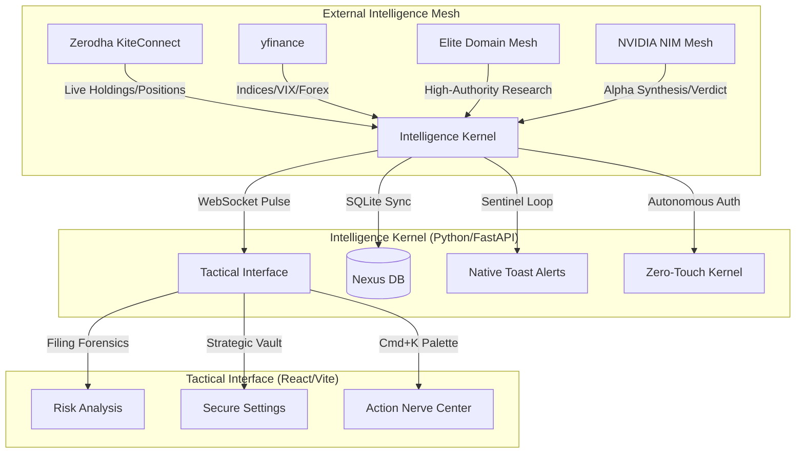

# 🛡️ Sovereign Intelligence Nexus (v2.4)
### *Strategic Command Center for Elite Indian Retail Traders*

> **Status:** Gold Master Candidate | **Build:** v2.4 | **System:** Sovereign Intelligence Nexus

The Sovereign Intelligence Nexus is a high-fidelity, local-first intelligence engine engineered to provide retail traders with institutional-grade edge. It synthesizes real-time market pulse, forensic document analysis, and institutional whale-tracking into a strictly utilitarian, zero-distraction tactical environment.

---

## 🗺️ System Architecture (The Nexus Map)



---

## 📜 Table of Contents
1. [Core Features](#-core-features)
2. [Strategic Components](#-strategic-components)
3. [NVIDIA NIM: The Reasoning Mesh](#-nvidia-nim-the-reasoning-mesh)
4. [Zerodha Tactical Integration](#-zerodha-tactical-integration)
5. [Tactical Installation](#-tactical-installation)
6. [API Forensic Guide](#-api-forensic-guide)

---

## 🛡️ Core Features
- **NVIDIA Powered:** Prioritizes **Llama 3.1 405B** via NVIDIA NIM for free, institutional-grade reasoning.
- **Zerodha Kite Pulse:** Native tracking of live holdings and positions.
- **Zero-Touch Auth:** Autonomous daily session synchronization using headless TOTP 2FA.
- **Elite Domain Mesh:** Research queries weighted against high-authority finance domains.
- **Forensic Filing Engine:** LLM-powered scanning of regulatory documents for "fine print" risks.
- **Native OS Alerts:** High-priority Windows toast notifications for VIX spikes.

---

## 🧠 NVIDIA NIM: The Reasoning Mesh

The Nexus v2.4 is engineered for **NVIDIA NIM Priority**. By leveraging the Llama 3.1 405B model, the system achieves "Gold Standard" reasoning without the token costs of traditional providers.

| Provider | Model (Nexus Priority) | Variable |
| :--- | :--- | :--- |
| **NVIDIA** | **Llama 3.1 405B Instruct** | `NVIDIA_API_KEY` |
| **OpenAI** | GPT-4o (Fallback) | `OPENAI_API_KEY` |

> [!IMPORTANT]
> The Nexus Kernel automatically detects your `NVIDIA_API_KEY` and utilizes the **NVIDIA Intelligence Mesh** as its primary engine. If NVIDIA credits are exhausted, it seamlessly falls back to OpenAI or Gemini.

---

## 🔑 Zerodha Tactical Integration

1. **Vault Your Credentials:** Navigate to the **Settings** tab in the Nexus Interface.
2. **Inject Strategic Data:** Enter your Zerodha Client ID, Password, and TOTP Secret Key.
3. **Ignite Sync:** Click **"Ignite Nexus Sync"**. 

---

## 🛠️ Tactical Installation

### Windows (Native/PowerShell)
1. **Prerequisites:** Install Python 3.10+ and Node.js 20+.
2. **Environment Tuning:**
   ```powershell
   .\install.ps1
   ```
3. **Ignition:** Execute `.\finintel.ps1` or `python run.py`.

---

## 📡 API Forensic Guide

| Provider | Purpose | Data Depth |
| :--- | :--- | :--- |
| **KiteConnect** | Primary Brokerage | Live Holdings, PnL, Order Book |
| **NVIDIA Mesh** | Alpha Reasoning | Strategic Synthesis & Verdicts |
| **Elite Mesh** | Authority Data | Moneycontrol, Livemint, SEBI Filings |
| **yfinance** | Market Pulse | Indices, VIX, Forex, Sentiment |

---
**Status: Sovereign & Invincible.**
*Powered by NVIDIA NIM.*
