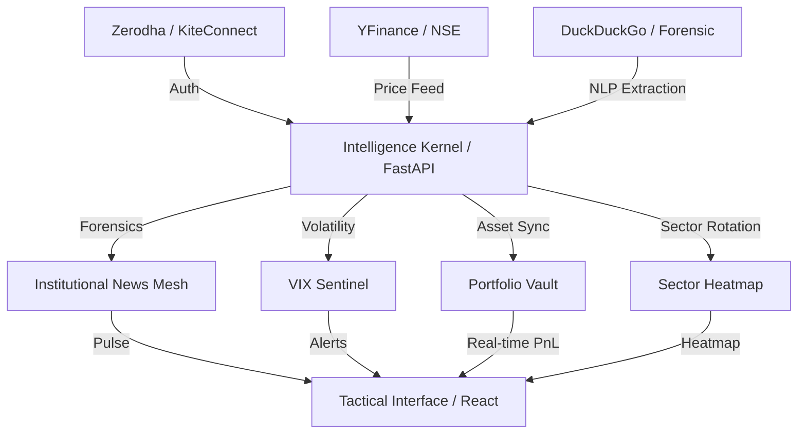

# FinIntel Terminal / Strategic Intelligence Nexus

Institutional-grade financial intelligence terminal designed for the Indian market. Optimized for high-fidelity retail research, professional portfolio management, and strategic market forensics.

---

## 🏛️ Strategic Architecture Map



---

## 🚀 Professional Feature Set

### 1. Market Intelligence Overview
Real-time pulse of Nifty/Sensex, India VIX alerts (>20 threshold), and the **Institutional Whale Feed** tracking FII/DII and Bulk/Block deals parsed via LLM.

### 2. Sector Performance Heatmap
A professional top-down rotation tool visualizing relative strength across all primary Nifty sectoral indices (Bank, Auto, IT, Pharma, FMCG, Metal, Realty).

### 3. Forensic Document Analysis
Advanced NLP engine for scanning regulatory filings and legal fine print. Returns risk clauses, court case mentions, and regulatory flags with institutional precision.

### 4. Professional Portfolio Management
Secure, AES-256 encrypted vault for asset tracking. Real-time PnL calculation synchronized with live exchange data.

### 5. Institutional Intelligence Mesh
Multi-LLM reasoning engine (NVIDIA NIM, Groq, OpenAI) with persistent strategic context for evolved ticker analysis.

---

## 🛡️ Security & Compliance

- **AES-256 Vault:** All credentials (API Keys, Broker secrets) are encrypted locally using Fernet (AES-256).
- **Environment Parity:** Supports `.env` injection for production-grade security.
- **Broker Policy:** Designed for personal research use. Professional TOTP flow handles Zerodha session handshakes securely.

---

## ⚡ Zero-Config Ignition

From a clean repository, run the global orchestrator to weaponize the entire terminal:

```powershell
./install.ps1
finintel
```

---

**Institutional Master v4.2 Build.**
🛡️💹
