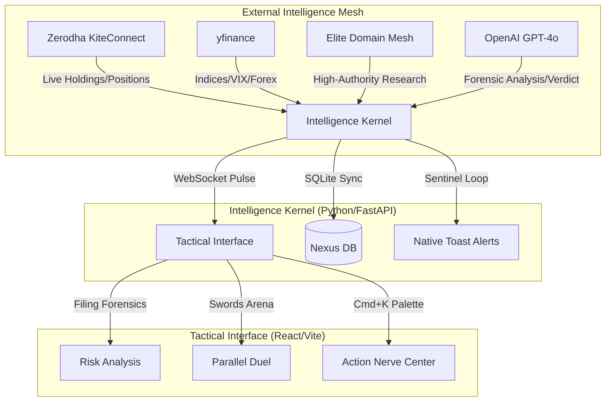

# 🛡️ Sovereign Intelligence Nexus (v2.3)
### *Strategic Command Center for Elite Indian Retail Traders*

> **Status:** Gold Master Candidate | **Build:** v2.3 | **System:** Sovereign Intelligence Nexus

The Sovereign Intelligence Nexus is a high-fidelity, local-first intelligence engine engineered to provide retail traders with institutional-grade edge. It synthesizes real-time market pulse, forensic document analysis, and institutional whale-tracking into a strictly utilitarian, zero-distraction tactical environment.

---

## 🗺️ System Architecture (The Nexus Map)



---

## 📜 Table of Contents
1. [Core Features](#-core-features)
2. [Strategic Components](#-strategic-components)
3. [Tactical Installation](#-tactical-installation)
4. [Docker Orchestration](#-docker-orchestration)
5. [API Forensic Guide](#-api-forensic-guide)
6. [Tactical Operations](#-tactical-operations)
7. [System Hardening](#-system-hardening)

---

## 🛡️ Core Features
- **Zerodha Kite Pulse:** Native tracking of live holdings and positions.
- **Elite Domain Mesh:** Research queries weighted against high-authority finance domains (Moneycontrol, ET, SEBI).
- **Forensic Filing Engine:** LLM-powered scanning of regulatory documents for "fine print" risks.
- **Whale Trade Sentinel:** Automated tracking of institutional whale activity via the Strategic Mesh.
- **Native OS Alerts:** High-priority Windows toast notifications for VIX spikes and Whale detections.
- **Nexus Command Palette:** `Cmd+K` tactical interface for instant system-wide navigation.

---

## 🛠️ Tactical Installation

### Windows (Native/PowerShell)
1. **Prerequisites:** Install Python 3.10+ and Node.js 20+.
2. **Environment Tuning:**
   ```powershell
   # Run the Nexus Installer
   .\install.ps1
   ```
3. **Configuration:** Populate `.env` in the root directory:
   ```env
   ZERODHA_API_KEY=your_key
   ZERODHA_ACCESS_TOKEN=your_token
   OPENAI_API_KEY=your_key
   ```
4. **Ignition:** Execute `finintel` in your terminal.

---

## 🐳 Docker Orchestration

The Nexus is fully containerized for secure, isolated deployment.

```bash
# Build and Launch the Nexus Stack
docker-compose up --build -d
```

### Volume Mapping
- `./backend:/app`: Persists the Intelligence Kernel.
- `./finintel.db:/app/finintel.db`: Persists your portfolio and chat history.

---

## 📡 API Forensic Guide

| Provider | Purpose | Data Depth |
| :--- | :--- | :--- |
| **KiteConnect** | Primary Brokerage | Live Holdings, PnL, Order Book |
| **OpenAI** | Reasoning Mesh | Forensic Analysis, Strategic Verdicts |
| **Elite Mesh** | High-Authority Data | Moneycontrol, Livemint, SEBI Filings |
| **yfinance** | Market Pulse | Indices, VIX, Forex, Sentiment |

---

## ⌨️ Tactical Operations

### Global Hotkeys
- **`Ctrl+K` / `Cmd+K`**: Launch the **Nexus Command Palette**.
- **`1-5`**: Switch between Intelligence Tabs.
- **`T`**: Toggle **Terminal Mode** (High-Contrast Monospace).
- **`Esc`**: Close palette or modals.

### Forensic Filing Scan
Paste the text of any regulatory filing into the **Nexus > Filing Analyzer**. The engine will extract hidden Risk Clauses and Regulatory Red Flags.

---

## 🔒 System Hardening
- **AES-256 Encryption:** All API keys are encrypted at rest using Fernet.
- **Structured Logging:** All intelligence decisions are logged in `system.log` as JSON.
- **Local-First Privacy:** No data ever leaves your machine except for direct API calls to your configured providers.

---
**Status: Sovereign & Invincible.**
*The Nexus is Active.*
