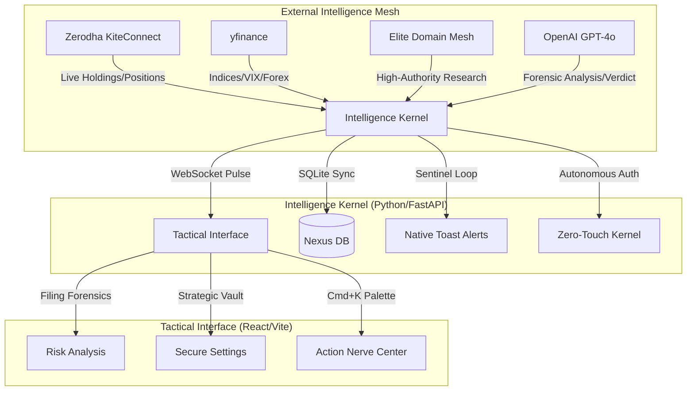

# 🛡️ Sovereign Intelligence Nexus (v2.4)
### *Strategic Command Center for Elite Indian Retail Traders*

> **Status:** Gold Master Candidate | **Build:** v2.4 | **System:** Sovereign Intelligence Nexus

The Sovereign Intelligence Nexus is a high-fidelity, local-first intelligence engine engineered to provide retail traders with institutional-grade edge. It synthesizes real-time market pulse, forensic document analysis, and institutional whale-tracking into a strictly utilitarian, zero-distraction tactical environment.

---

## 🗺️ System Architecture (The Nexus Map)



---

## 📜 Table of Contents
1. [Core Features](#-core-features)
2. [Strategic Components](#-strategic-components)
3. [Zero-Touch Zerodha Auth](#-zero-touch-zerodha-auth)
4. [Tactical Installation](#-tactical-installation)
5. [Docker Orchestration](#-docker-orchestration)
6. [API Forensic Guide](#-api-forensic-guide)
7. [Tactical Operations](#-tactical-operations)

---

## 🛡️ Core Features
- **Zerodha Kite Pulse:** Native tracking of live holdings and positions.
- **Zero-Touch Auth:** Autonomous daily session synchronization using headless TOTP 2FA.
- **Elite Domain Mesh:** Research queries weighted against high-authority finance domains.
- **Forensic Filing Engine:** LLM-powered scanning of regulatory documents for "fine print" risks.
- **Whale Trade Sentinel:** Automated tracking of institutional whale activity.
- **Native OS Alerts:** High-priority Windows toast notifications for VIX spikes.
- **Nexus Command Palette:** `Cmd+K` tactical interface for instant navigation.

---

## 🔑 Zero-Touch Zerodha Auth

The Nexus v2.4 now features an autonomous authentication engine. To activate:

1. **Vault Your Credentials:** Navigate to the **Settings** tab in the Nexus Interface.
2. **Inject Strategic Data:** Enter your Zerodha Client ID, Password, and TOTP Secret Key.
3. **Ignite Sync:** Click **"Ignite Nexus Sync"**. 
   > [!TIP]
   > The Nexus will autonomously perform the headless login, generate the TOTP, and synchronize your session key—no manual token generation required.

---

## 🛠️ Tactical Installation

### Windows (Native/PowerShell)
1. **Prerequisites:** Install Python 3.10+ and Node.js 20+.
2. **Environment Tuning:**
   ```powershell
   # Run the Nexus Installer
   .\install.ps1
   ```
3. **Ignition:** Execute `.\finintel.ps1` or `python run.py`.

---

## 🐳 Docker Orchestration

```bash
# Build and Launch the Nexus Stack
docker-compose up --build -d
```

---

## 📡 API Forensic Guide

| Provider | Purpose | Data Depth |
| :--- | :--- | :--- |
| **KiteConnect** | Primary Brokerage | Live Holdings, PnL, Order Book |
| **OpenAI** | Reasoning Mesh | Forensic Analysis, Strategic Verdicts |
| **Elite Mesh** | Authority Data | Moneycontrol, Livemint, SEBI Filings |
| **yfinance** | Market Pulse | Indices, VIX, Forex, Sentiment |

---

## ⌨️ Tactical Operations

- **`Ctrl+K` / `Cmd+K`**: Launch the **Nexus Command Palette**.
- **`T`**: Toggle **Terminal Mode** (High-Contrast Monospace).

---
**Status: Sovereign & Invincible.**
*The Nexus is Active.*
