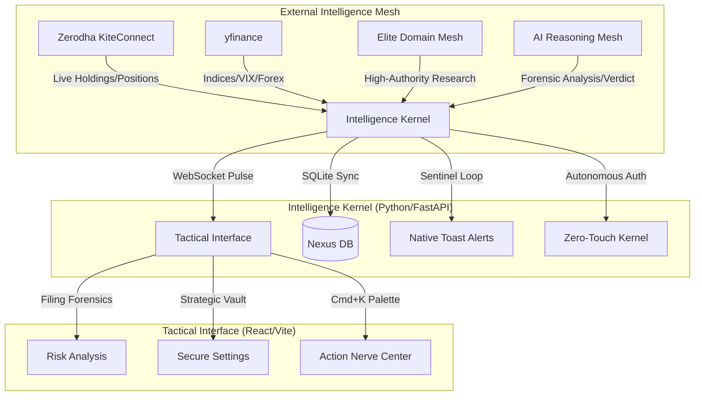

# 🛡️ Sovereign Intelligence Nexus (v2.4)
### *Strategic Command Center for Elite Indian Retail Traders*

> **Status:** Gold Master Candidate | **Build:** v2.4 | **System:** Sovereign Intelligence Nexus

The Sovereign Intelligence Nexus is a high-fidelity, local-first intelligence engine engineered to provide retail traders with institutional-grade edge. It synthesizes real-time market pulse, forensic document analysis, and institutional whale-tracking into a strictly utilitarian, zero-distraction tactical environment.

---

## 🗺️ System Architecture (The Nexus Map)



---

## 📜 Table of Contents
1. [Core Features](#-core-features)
2. [Strategic Components](#-strategic-components)
3. [Zerodha Tactical Integration](#-zerodha-tactical-integration)
4. [AI Reasoning Mesh (Multi-LLM)](#-ai-reasoning-mesh-multi-llm)
5. [Tactical Installation](#-tactical-installation)
6. [API Forensic Guide](#-api-forensic-guide)

---

## 🛡️ Core Features
- **Zerodha Kite Pulse:** Native tracking of live holdings and positions.
- **Zero-Touch Auth:** Autonomous daily session synchronization using headless TOTP 2FA.
- **Elite Domain Mesh:** Research queries weighted against high-authority finance domains.
- **Forensic Filing Engine:** LLM-powered scanning of regulatory documents for "fine print" risks.
- **Whale Trade Sentinel:** Automated tracking of institutional whale activity.
- **Native OS Alerts:** High-priority Windows toast notifications for VIX spikes.
- **Nexus Command Palette:** `Cmd+K` tactical interface for instant navigation.

---

## 🔑 Zerodha Tactical Integration

The Nexus v2.4 supports two distinct authentication flows:

### Option A: Zero-Touch Auth (Recommended)
1. **Vault Your Credentials:** Navigate to the **Settings** tab in the Nexus Interface.
2. **Inject Strategic Data:** Enter your Zerodha Client ID, Password, and TOTP Secret Key.
3. **Ignite Sync:** Click **"Ignite Nexus Sync"**. 

### Option B: Manual Token Flow (Alternative)
1. **Developer App:** Set **Redirect URL** to `http://127.0.0.1` in the Kite Dashboard.
2. **Login URL:** Open `https://kite.zerodha.com/connect/login?v=3&api_key=YOUR_API_KEY`.
3. **Extract Token:** Copy the `request_token` from the resulting "broken" page URL bar.
4. **Generate Session:**
   ```python
   from kiteconnect import KiteConnect
   kite = KiteConnect(api_key="YOUR_API_KEY")
   data = kite.generate_session("YOUR_TOKEN", api_secret="YOUR_SECRET")
   print(data["access_token"])
   ```
5. **Inject:** Update `ZERODHA_ACCESS_TOKEN` in your `.env`.

---

## 🧠 AI Reasoning Mesh (Multi-LLM)

The Nexus is model-agnostic and supports the following intelligence providers:

| Provider | Model | Variable |
| :--- | :--- | :--- |
| **OpenAI** | GPT-4o / GPT-4o-mini | `OPENAI_API_KEY` |
| **Anthropic** | Claude 3.5 Sonnet | `ANTHROPIC_API_KEY` |
| **Google** | Gemini 2.0 Pro | `GEMINI_API_KEY` |
| **NVIDIA** | Llama 3.1 405B | `NVIDIA_API_KEY` |

> [!TIP]
> The Nexus Kernel automatically detects your active keys in the `.env` and selects the highest-performing available model for strategic synthesis.

---

## 🛠️ Tactical Installation

### Windows (Native/PowerShell)
1. **Prerequisites:** Install Python 3.10+ and Node.js 20+.
2. **Environment Tuning:**
   ```powershell
   .\install.ps1
   ```
3. **Ignition:** Execute `.\finintel.ps1` or `python run.py`.

---

## 📡 API Forensic Guide

| Provider | Purpose | Data Depth |
| :--- | :--- | :--- |
| **KiteConnect** | Primary Brokerage | Live Holdings, PnL, Order Book |
| **AI Mesh** | Reasoning | Forensic Analysis, Strategic Verdicts |
| **Elite Mesh** | Authority Data | Moneycontrol, Livemint, SEBI Filings |
| **yfinance** | Market Pulse | Indices, VIX, Forex, Sentiment |

---
**Status: Sovereign & Invincible.**
*The Nexus is Active.*
