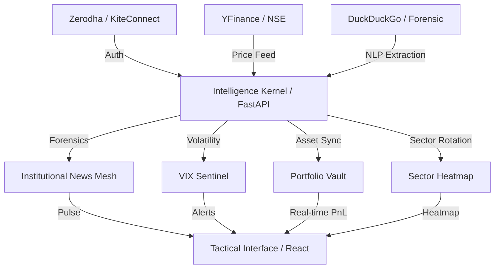

# FinIntel Terminal: Strategic Intelligence Nexus
> **Institutional-grade financial intelligence terminal designed for the Indian market.**

---

## 🏛️ Strategic Architecture



---

## 📑 Table of Contents
- [Features](#-features)
- [Tech Stack](#-tech-stack)
- [Getting Started](#-getting-started)
- [Configuration](#-configuration)
- [Project Structure](#-project-structure)
- [Security](#-security)
- [Deployment](#-deployment)

---

## 🚀 Features

### 1. Market Intelligence Dashboard
- **Institutional Market Feed:** Real-time tracking of FII/DII net flows and Bulk/Block deals parsed via LLM.
- **Strategic Titan Sentinel:** Intelligence extraction from X (Twitter) and professional blogs for major Indian investors.
- **Volatility Sentinel:** Background monitoring with native OS alerts for spikes above 20 (India VIX).

### 2. Forensic Research Module
- **Institutional Ticker Research:** Multi-LLM reasoning (NVIDIA, Groq, OpenAI) with persistent context for evolved ticker dialogue.
- **Regulatory Filing Forensic:** NLP-powered scan for legal document risk detection and fine print analysis.
- **Market Accumulation Pulse:** Automated pattern detection for Accumulation and Distribution phases.

### 3. Professional Portfolio Vault
- **Real-time Asset Tracking:** Automated PnL calculation synchronized with live NSE/BSE exchange data.
- **Sector Performance Heatmap:** Visual sectoral rotation analysis across all primary Nifty indices.
- **Brokerage Sync:** Seamless Zerodha KiteConnect integration for live holdings retrieval.

---

## 🛠️ Tech Stack

- **Kernel:** Python 3.10+, FastAPI, Uvicorn, Asynchronous Tasks.
- **Interface:** React 18, Vite, Tailwind CSS, Framer Motion.
- **Intelligence:** NVIDIA NIM (Llama-3.1), Groq Cloud, OpenRouter, OpenAI.
- **Data:** YFinance, DuckDuckGo Search, KiteConnect SDK.
- **Security:** AES-256 (Fernet) Encryption, SQLite Secure Vault.

---

## ⚡ Getting Started

### 1. Zero-Config Installation
Clone the repository and run the global orchestrator:
```powershell
./install.ps1
finintel
```

### 2. Manual Setup
If you prefer manual provisioning:
```bash
# Backend
pip install -r backend/requirements.txt
python backend/main.py

# Frontend
npm install
npm run dev
```

---

## ⚙️ Configuration

### Zerodha KiteConnect
1. Create a developer app at [Zerodha Developers](https://developers.kite.trade/apps).
2. Set Redirect URL: `http://localhost:8008/market/zerodha/callback`.
3. Capture your **API Key**, **API Secret**, and **Client ID**.
4. Secure your **TOTP Seed** during your profile's 2FA setup.

### Intelligence Mesh
Configure your API keys in the **Settings** tab:
- **NVIDIA_API_KEY:** For elite-tier Llama-3.1 405B reasoning.
- **GROQ_API_KEY:** For ultra-fast market forensics.
- **OPENROUTER_API_KEY:** For universal model access (Claude/Gemini).

---

## 📂 Project Structure

```text
finintel-pro/
├── backend/
│   ├── main.py          # Intelligence Kernel
│   ├── requirements.txt # Kernel Dependencies
├── src/
│   ├── components/      # Tactical Panels
│   │   ├── OverviewPanel.tsx
│   │   ├── SectorPanel.tsx
│   │   ├── PortfolioPanel.tsx
│   │   ├── ResearchPanel.tsx
│   │   └── SettingsPanel.tsx
│   └── App.tsx          # Interface Root
├── install.ps1          # Global Installer
├── run.py               # Root Orchestrator
├── finintel.db          # Encrypted Vault
└── secret.key           # AES-256 Master Key
```

---

## 🛡️ Security & Compliance
- **AES-256 Encryption:** All credentials are encrypted locally using the Fernet protocol.
- **No Cloud Storage:** Your data and keys never leave your machine.
- **Compliance:** Intended for professional research and strategic analysis.

---

**FinIntel Terminal v4.5 Build.**
🛡️💹
