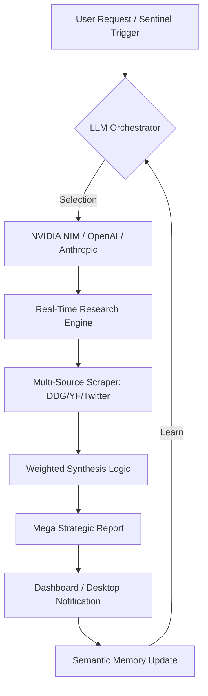

# 🚀 FinIntel Pro: Sovereign Market Intelligence Engine

**FinIntel Pro** is a production-grade, **Native Windows** self-hosted financial intelligence command center. It is optimized for the **NVIDIA NIM** ecosystem alongside OpenAI and Anthropic, delivering ultra-low latency market synthesis for experienced traders.

> [!IMPORTANT]
> **NATIVE WINDOWS ARCHITECTURE:** This software is integrated directly into the Windows Notification Center for real-time background alerting.


---

## 📑 Table of Contents
1.  [The Sovereign Workflow (Process Map)](#-the-sovereign-workflow)
2.  [Core Capabilities](#-core-capabilities)
    *   [NVIDIA NIM & Multi-LLM Orchestration](#nvidia-nim--multi-llm-orchestration)
    *   [Global Titan Sentinel](#global-titan-sentinel)
    *   [Semantic Kernel Memory](#semantic-kernel-memory)
3.  [Technical Specification](#-technical-specification)
4.  [Installation & Setup](#-installation--setup)
5.  [Usage Guide](#-usage-guide)
6.  [Data Strategy](#-data-strategy)

---

## 🔄 The Sovereign Workflow
How FinIntel Pro processes intelligence in real-time:



---

## 🛡️ Core Capabilities

### NVIDIA NIM & Multi-LLM Orchestration
FinIntel Pro is built to leverage the **NVIDIA NIM** (Microservices) architecture for the fastest possible inference. 
- **Low Latency:** Optimized for high-frequency market analysis.
- **Provider Choice:** Swap between NVIDIA NIM, OpenAI, Anthropic, or Groq in real-time via the settings panel.
- **AES-256 Vault:** All API keys are encrypted locally; your intelligence remains sovereign.

### Global Titan Sentinel (Domestic & International)
The background kernel operates every 15 minutes to track:
- **Domestic Bulls:** Vijay Kedia, Ashish Kacholia, Mukul Agrawal.
- **Global Titans:** Elon Musk, Michael Saylor, Cathie Wood, Jensen Huang.
- **Predictive Scans:** Searching for "Upcoming Announcements" and "Secret Statements" to notify you before the market moves.

### Semantic Kernel Memory
- **Learning Engine:** Remembers your risk profile and asset preferences across sessions.
- **Pruning Logic:** Automatically distills chat history into semantic summaries to maintain a **10MB footprint**.

---

## 🏗️ Technical Specification

### Database Schema (SQLite)
- `chat_history`: Persistent logs for the Advisor.
- `semantic_memory`: Distilled user preferences.
- `research_history`: Archives of all "Mega Reports."
- `saved_opportunities`: The "Sovereign Vault" for pinned picks.

### Security
- **Local-Only:** No research data or keys ever leave your machine except via direct LLM API calls.
- **Encryption:** AES-256 (Fernet) protection for all sensitive credentials.

---

## ⚙️ Installation & Setup

### 1. Prerequisites
- Python 3.10+ | Node.js 18+
- API Key (NVIDIA NIM, OpenAI, or Anthropic)

### 2. Automated Install
1. **CD into the Root Directory:**
   ```bash
   cd E:\finintel-pro
   ```
2. **Run the Installer:**
   ```powershell
   .\install.ps1
   ```

### 3. Global Command
Once installed, launch from **any terminal window** on your system:
```bash
finintel
```

---

## ⚖️ Regulatory & Disclaimer
**FinIntel Pro** is a **research and insight tool**. It is not a SEBI-registered investment advisor. All trades are at the user's own risk.

---
**Build 1.0.0 | Hardened Sovereign Deployment**
