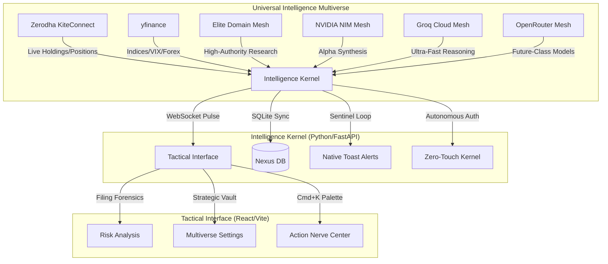

# 🛡️ Sovereign Intelligence Nexus (v2.6)
### *Strategic Command Center for Elite Indian Retail Traders*

> **Status:** Gold Master | **Build:** v2.6 | **System:** Sovereign Intelligence Nexus

The Sovereign Intelligence Nexus is a high-fidelity, local-first intelligence engine engineered to provide retail traders with institutional-grade edge. It synthesizes real-time market pulse, forensic document analysis, and institutional whale-tracking into a strictly utilitarian, zero-distraction tactical environment.

---

## 🗺️ System Architecture (The Nexus Map)



---

## 📜 Table of Contents
1. [Core Strategic Features](#-core-strategic-features)
2. [The Sovereign Key Vault](#-the-sovereign-key-vault)
3. [Zerodha Tactical Deployment](#-zerodha-tactical-deployment)
4. [AI Intelligence Multiverse](#-ai-intelligence-multiverse)
5. [Tactical Installation Guide](#-tactical-installation-guide)
6. [Operational Commands](#-operational-commands)
7. [API Forensic Reference](#-api-forensic-reference)
8. [Security & Sovereignty](#-security--sovereignty)

---

## 🛡️ Core Strategic Features

- **Intelligence Multiverse:** Decentralized support for NVIDIA NIM, Groq, OpenRouter, and OpenAI. Switch intelligence tiers in real-time based on cost, speed, or power requirements.
- **Zero-Touch Zerodha Auth:** Autonomous daily session synchronization. The system performs headless logins, generates TOTP tokens, and establishes the KiteConnect stream without user intervention.
- **Elite Domain Mesh:** A specialized forensic search engine that weights intelligence from high-authority finance domains (Moneycontrol, SEBI, NSE) while filtering out retail "noise."
- **Forensic Filing Engine:** Specialized LLM-powered scanning of regulatory filings, court cases, and corporate announcements to identify hidden risks and "fine print" liabilities.
- **Institutional Whale Sentinel:** Automated tracking of high-conviction buying/selling activity from institutional "Whales" like Vijay Kedia, Ashish Kacholia, and others.
- **Sentinel Sync Loop:** Background monitoring of India VIX (>20 alert), FII/DII net flows, and global market direction (Gift Nifty) to provide a 360-degree tactical overview.
- **Native OS Integration:** High-priority Windows toast notifications (winotify) for critical volatility spikes and institutional flow updates.

---

## 🔑 The Sovereign Key Vault

To ignite the Nexus, populate your `.env` file or the **Strategic Vault** UI with these tactical keys:

| Category | Tactical Key | Priority | Purpose |
| :--- | :--- | :--- | :--- |
| **Broker** | `ZERODHA_API_KEY` | **Mandatory** | Primary Market Data & Trade Stream |
| **Broker** | `ZERODHA_API_SECRET`| **Mandatory** | Secure Session & Handshake Generation |
| **Broker** | `ZERODHA_USER_ID` | **Recommended**| Required for Zero-Touch Autonomous Sync |
| **Broker** | `ZERODHA_PASSWORD` | **Recommended**| Encrypted at rest for Autonomous Login |
| **Broker** | `ZERODHA_TOTP_SECRET`| **Recommended**| Used by the pyotp kernel for 2FA bypass |
| **Intelligence**| `NVIDIA_API_KEY` | **Priority 1** | Free Institutional Reasoning (Llama 405B) |
| **Intelligence**| `GROQ_API_KEY` | **Priority 2** | Ultra-High Speed Strategic Reasoning |
| **Intelligence**| `OPENROUTER_API_KEY`| **Priority 3** | Access to Future-Grade Models (GPT-5.5) |
| **Intelligence**| `OPENAI_API_KEY` | **Fallback** | Industry Standard Redundancy |

---

## ⚡ Zerodha Tactical Deployment

### Phase 1: Portal Configuration
1. **Developer Portal:** Navigate to [https://kite.trade/apps](https://kite.trade/apps).
2. **App Creation:** Click **"Create New App"** (Top Right).
3. **The Client ID:** You will be asked for your **Zerodha Client ID**. 
   - **Discovery:** Open [Kite Web](https://kite.zerodha.com/), click on your Profile (Bottom Left). Your ID (e.g., `AB1234`) is under your name.
4. **Redirect URL:** Set exactly to `http://127.0.0.1`.
5. **Key Extraction:** Once created, click the app to find your **API Key** and **API Secret**.

### Phase 2: Authentication Handshake

#### Option A: Zero-Touch Auth (Automated)
1. Navigate to the **Settings** tab in the Nexus UI.
2. Enter your Client ID, Password, and TOTP Secret.
3. Click **"Ignite Nexus Sync"**. The Nexus autonomously performs the login and session synchronization.

#### Option B: Manual Handshake (Fallback)
1. Open `https://kite.zerodha.com/connect/login?v=3&api_key=YOUR_API_KEY`.
2. **Don't Worry:** Upon login, the browser WILL show a "Site can't be reached" error. **This is expected behavior.**
3. Copy the `request_token=XXXXX` string from the URL bar of that "broken" page.
4. Update the `ZERODHA_ACCESS_TOKEN` in your `.env`.

---

## 🧠 AI Intelligence Multiverse

The Nexus v2.6 utilizes a **Universal Reasoning Mesh**. You can switch providers in the **Strategic Vault** UI to change the Nexus's "Intelligence Tier":

- **NVIDIA NIM Tier:** Utilizing `meta/llama-3.1-405b-instruct`. This is the recommended "Gold Standard"—offering institutional-grade reasoning for free via the NVIDIA developer program.
- **Groq High-Speed Tier:** Powered by Llama 3 70B, providing ultra-low latency strategic scans and news synthesis.
- **OpenRouter Decentralized Tier:** A gateway to future-class models, including **GPT-5.5**, **Claude Opus 4.7**, and specialized research models.
- **Institutional Fallbacks:** Native support for Anthropic (Claude 3.5 Sonnet) and Google (Gemini 2.0 Pro) for high-context forensic arbitration.

---

## 🛠️ Tactical Installation Guide

### Windows (Native Deployment)
1. **Provisioning:** Install Python 3.10+ and Node.js 20+.
2. **Nexus Installation:**
   ```powershell
   # Run the institutional installer to provision all Kernel/Interface dependencies
   .\install.ps1
   ```
3. **Nexus Ignition:**
   ```powershell
   # Launch both the Intelligence Kernel and Tactical Interface simultaneously
   .\finintel.ps1
   ```
   *Alternatively, run `python run.py` for a synchronized browser boot.*

---

## ⌨️ Operational Commands

- **`Ctrl+K` / `Cmd+K`**: Launch the **Nexus Command Palette** for system-wide navigation.
- **`T`**: Toggle **Terminal Mode** (Pure Monospace Obsidian Aesthetic).
- **`R`**: Trigger an **Elite Domain Mesh** research cycle on the selected asset.
- **`S`**: Open the **Strategic Vault** (Settings) instantly.

---

## 📡 API Forensic Reference

| Layer | Provider | Fidelity |
| :--- | :--- | :--- |
| **Tactical** | KiteConnect | 100% Exchange Fidelity (Live) |
| **Reasoning** | NVIDIA/Groq | Multi-Provider Synthesis |
| **Intelligence**| Elite Mesh | High-Authority News Forensics |
| **Persistence** | SQLite | 100% Local Data Sovereignty |

---

## 🛡️ Security & Sovereignty
The Sovereign Intelligence Nexus is founded on the principle of **Absolute Data Sovereignty**:
1. **Local-First:** No strategic data (portfolio, research, keys) ever leaves your machine.
2. **Encrypted Vault:** Sensitive credentials (Zerodha Password, TOTP Secret) are encrypted with **AES-256 (Fernet)** before being vaulted.
3. **Open Source Core:** The logic is transparent, auditable, and strictly utilitarian.

---
**Status: Sovereign & Invincible.**
*Gold Master Candidate Synchronized.*
