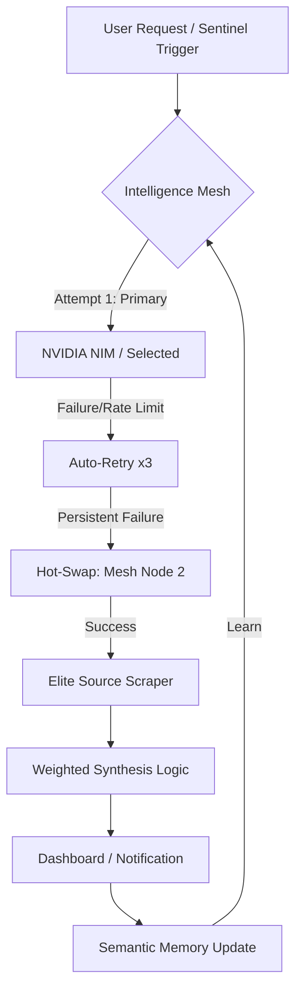

# 🚀 FinIntel Pro: Sovereign Intelligence Mesh

**FinIntel Pro** is a production-grade, **Native Windows** self-hosted financial intelligence command center. It operates via a **Resilient Intelligence Mesh** that automatically orchestrates between **NVIDIA NIM**, OpenAI, Anthropic, and Groq to deliver high-fidelity market synthesis.


---

## 🔄 The Sovereign Mesh Workflow
How FinIntel Pro manages intelligence across multiple providers:



---

## 🛡️ Core Capabilities

### 1. Sovereign Intelligence Mesh
- **Auto-Fallback:** If your primary API fails, the system automatically swaps to the next node in the mesh (e.g., NVIDIA -> OpenAI -> Anthropic -> Groq).
- **Triple-Retry Logic:** Built-in resilience with a 3-attempt loop for every intelligence call.
- **Task-Based Scaling:** Automatically uses fast models for 24/7 scanning and "Heavy" models for deep strategic research.

### 2. Elite Source Matrix (50 Domains)
The kernel is hardcoded to prioritize research from the top 50 financial domains in the Indian and Global markets, including:
- **Domestic:** Moneycontrol, Zerodha Pulse, LiveMint, NSE/BSE Official.
- **Global:** MicroStrategy (Saylor), Ark Invest (Wood), NVIDIA (Huang), Elon Musk.
- **Sentiment:** Elite blog threads and expert-level social pulse.

### 3. High-Fidelity Charting Engine
- **Multi-View:** Instantly swap between **Candle**, **Line**, and **Area** graphs.
- **Technical Overlays:** Integrated Moving Averages (MA) and Relative Strength Index (RSI) for professional trend analysis.

### 4. Semantic Kernel Memory
- **10MB Footprint:** Automatically distills chat history into semantic summaries.
- **Privacy:** All keys are protected by **AES-256** local encryption; no keys ever leave your machine.

---

## 📂 Project Structure
- `/backend`: FastAPI Resilient Kernel & Mesh Orchestrator.
- `/src`: React + Vite + Tailwind glassmorphism interface.
- `run.py`: The Self-Healing Launch Orchestrator.
- `DATA_SOURCES.md`: Rationale for the 50-source matrix.

---

## ⚙️ Installation & Setup

### 1. Prerequisites
- Python 3.10+ | Node.js 18+
- API Keys for Mesh Nodes (NVIDIA, OpenAI, etc.)

### 2. Automated Install
1. **CD into the Root Directory:**
   ```bash
   cd E:\finintel-pro
   ```
2. **Run the Installer:**
   ```powershell
   .\install.ps1
   ```

### 3. Global Command
Launch from **any terminal window**:
```bash
finintel
```

---

## ⚖️ Regulatory & Disclaimer
**FinIntel Pro** is a **research and insight tool**. It is not a SEBI-registered investment advisor. All trades are at the user's own risk.

---
**Build 1.1.0 | Invincible Intelligence Mesh**
